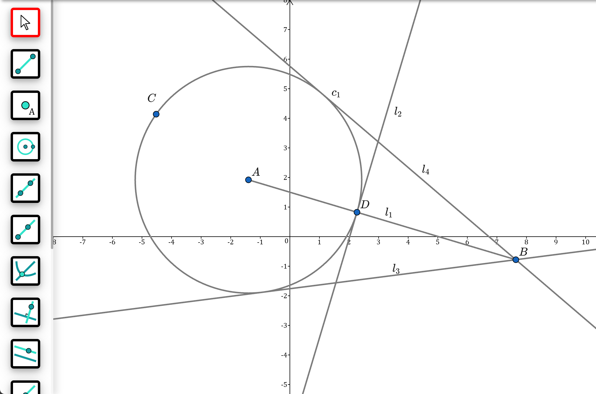

<p align="center">
  
</p>

<p align="center">
  An experimental, dependency-aware dynamic geometry playground for the web.
</p>

## About

Geomatrica is a browser-based dynamic geometry system for constructing and exploring Euclidean geometry. Move a point and every dependent line, circle, intersection, midpoint, or other construction is recalculated and redrawn automatically.

I originally built this project while I was in high school, taking inspiration from [GeoGebra](https://www.geogebra.org/) and its direct, interactive approach to geometry. Geomatrica is an independent personal project and is not affiliated with GeoGebra.

> Geomatrica is still experimental. It is a learning project and geometry engine in progress.

## Screenshot



## Highlights

- **Dynamic constructions** — objects retain their geometric relationships and update when a parent object moves.
- **Free and constrained points** — place points anywhere, or attach them to a line or circle.
- **Dependency-aware dragging** — drag free points, constrained points, lines, and circles while dependent objects follow.
- **Smart construction flow** — reuse nearby points or create a point on an existing shape while drawing.
- **Interactive canvas** — pan the plane, zoom around the cursor, and work with automatically scaled coordinate axes.
- **Readable diagrams** — points, lines, and circles receive labels that move with their objects.

## Construction tools

The toolbar currently exposes 15 modes:

| Category | Tools |
| --- | --- |
| Navigate | Move objects or pan the canvas |
| Points | Free/constrained point, intersection point, midpoint |
| Basic constructions | Segment, ray, line, extension line, centre-point circle |
| Line relationships | Perpendicular line, parallel line, perpendicular bisector |
| Advanced constructions | Angle bisector, tangent, circumcircle |

Intersections are supported between two lines, a line and a circle, or two circles. Angle bisectors can be constructed from three points or from two lines.

## Using the canvas

1. Select a construction tool from the left-hand toolbar.
2. Click existing objects or empty space as required by the construction.
3. For two-point objects such as segments and circles, click and drag from the first point to the second.
4. Switch to **Move** to drag objects or drag empty space to pan the canvas.

Additional controls:

- Use the mouse wheel to zoom around the pointer.
- Press <kbd>Esc</kbd> to cancel the current selection; press it again to return to Move mode.
- Dropping a new construction near an existing point snaps to and reuses that point.

## Run locally

Geomatrica requires a recent version of [Node.js](https://nodejs.org/).

```bash
git clone https://github.com/Chesium/Geomatrica.git
cd Geomatrica
npm install
npm run dev
```

Vite will print the local development URL in the terminal.

### Available commands

| Command | Purpose |
| --- | --- |
| `npm run dev` | Start the Vite development server |
| `npm run build` | Create a production build in `dist/` |
| `npm run typecheck` | Check the TypeScript project without emitting files |
| `npm run lint` | Run ESLint |

Pushes to `main` are built and deployed through the GitHub Pages workflow in [`.github/workflows/deploy.yml`](.github/workflows/deploy.yml).

## How it works

Geomatrica separates mathematical coordinates from display positions:

- **`crd`** (*coordinate*) represents a point in the mathematical plane and is used for geometry calculations.
- **`pos`** (*position*) represents a location on the screen and is used for rendering and pointer interaction.

Geometric objects track their parents and children. A drag updates the changed object, then propagates that change through its dependants. Rendering and hit detection are handled on a responsive PixiJS canvas, while React provides the surrounding interface and tool selection.

### Project structure

```text
src/
├── drawingMode/   # Tool interaction and construction workflows
├── shape/         # Points, lines, circles, and derived constructions
├── Mode/          # Geometry-mode registration
├── canvas.ts      # Rendering, coordinates, input, panning, and zooming
├── object.ts      # Shared object lifecycle and dependency behaviour
└── app.tsx        # React interface and toolbar
assets/
├── switchIcons/   # Construction-tool icons
└── screenshot.png
```

## Adding a construction tool

The usual extension path is:

1. Implement the geometric object in `src/shape/`.
2. Add its interaction workflow in `src/drawingMode/`.
3. Export and register the drawing mode in `src/drawingMode/dm.ts`.
4. Register any new base shape with the relevant mode in `src/Mode/`.
5. Add the tool and its icon to the toolbar in `src/Geomatrica.tsx` and `src/app.tsx`.

Run `npm run typecheck`, `npm run lint`, and `npm run build` before submitting a change.

## Built with

- [React](https://react.dev/) for the interface
- [PixiJS](https://pixijs.com/) for canvas rendering and interaction
- [KaTeX](https://katex.org/) for mathematical labels
- [TypeScript](https://www.typescriptlang.org/) for the geometry engine
- [Vite](https://vite.dev/) for development and production builds
